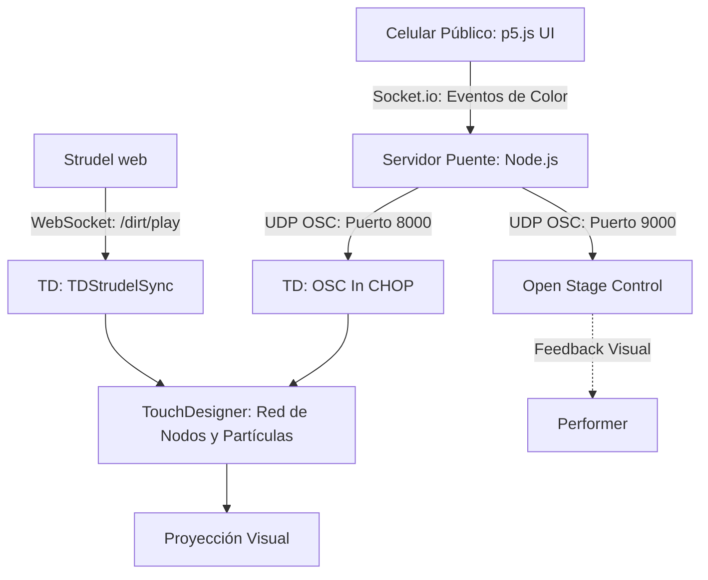

# Unidad 7


## Actividad 01: Definición de la interacción de la obra

### Definición de parámetros y roles
En el diseño de la interacción de esta instalación, se ha establecido una arquitectura de control distribuida entre el performer y los asistentes:

*   **¿Qué parámetros se controlan en tiempo real?** 
    Principalmente parámetros visuales. Se controlan las dinámicas del sistema de partículas (fuerzas, densidad, velocidad, físicas) y el mapeo de color (RGB) aplicado sobre las geometrías y partículas.
*   **¿Quién controla qué?**
    *   **El Artista/Performer:** Tiene el control estructural de la obra. Controla la física general, el comportamiento espacial de las partículas y los parámetros principales del sistema visual.
    *   **El Público:** Tiene un control de intervención estética. Por ahora, el público es el encargado de modificar y dictar el color (RGB) de las partículas y el entorno visual en tiempo real.
*   **¿Cómo participará el público?**
    La participación es a través de sus dispositivos móviles (celulares). Ingresarán a una interfaz web (desarrollada en p5.js) donde, mediante una superficie táctil, deslizarán su dedo para enviar coordenadas absolutas. Estos datos son mapeados a valores de color (0-255) y enviados al sistema central.
*   **¿Qué dispositivos se usarán?**
    *   **Celulares del público:** Ejecutando un cliente web con Socket.IO.
    *   **Servidor Local (Node.js/Express):** Actúa como host de la página web y puente de traducción de protocolos.
    *   **Open Stage Control:** Como superficie de monitoreo y control para el artista.
    *   **TouchDesigner:** Como motor gráfico y centro de recepción (vía OSC y WebSockets).
    *   **Strudel:** Como motor generativo de audio (vía WebSockets).

### Diagrama del Sistema
A continuación, se detalla la arquitectura de red y el flujo de datos del ecosistema:


### Plan de Implementación
Para garantizar el éxito de la integración, el desarrollo se dividió en las siguientes fases:
1.  **Levantamiento del Puente Node.js:** Programar el servidor capaz de servir páginas web, recibir Socket.IO y disparar mensajes OSC.
2.  **Desarrollo de la UI Móvil:** Programar la interfaz en p5.js, asegurando la escalabilidad y bloqueando gestos nativos del navegador móvil.
3.  **Configuración del Control del Artista:** Mapeo de Open Stage Control en el puerto 9000.
4.  **Acondicionamiento en TouchDesigner:** Recepción de señales y mapeo de datos usando nodos Math y CHOPs.

---

## Actividad 02: Implementación de los subsistemas de control

### Proceso de implementación y pruebas independientes

**1. Participación del público (Web a Node.js)**
Se desarrolló una interfaz web utilizando `p5.js`. Para la comunicación, se descartó el uso de WebSockets crudos a favor de `Socket.IO`, garantizando estabilidad y reconexión automática en dispositivos móviles. 
*   **Prueba:** Se ejecutó el servidor en localhost y se ingresó mediante la IP local desde el celular. 
*   **Problema encontrado:** Al deslizar el dedo en la pantalla, el navegador móvil intentaba hacer scroll o recargar la página, rompiendo la experiencia con un pantallazo blanco.
*   **Solución:** Se implementó un escudo CSS en el `index.html` (`touch-action: none; overflow: hidden;`) para bloquear los gestos nativos del navegador. Además, se reestructuró la interfaz para usar sliders nativos de HTML5 integrados con p5.js, enviando valores enteros limpios (0-255).

**2. Superficie de control (Node.js a Open Stage Control / TouchDesigner)**
Se configuró el entorno para recibir las señales de la web y enviarlas a los entornos de control.
*   **Problema encontrado:** Bucle de retroalimentación (Feedback loop). Cuando la señal llegaba a Open Stage Control, este se negaba a reenviarla a TouchDesigner por protocolos de seguridad internos.
*   **Solución:** Se diseñó un **Enrutamiento Paralelo** en el servidor Node.js. El servidor ahora dispara el mismo paquete OSC simultáneamente a Open Stage Control (puerto 9000) y a TouchDesigner (puerto 8000), eliminando intermediarios y reduciendo la latencia a cero.

---

## Actividad 03: Integración Total

### Proceso de Integración
La integración final consistió en unificar el motor de audio de Strudel y el control del público dentro de TouchDesigner. 
1.  **Audio Generativo:** Strudel envía la instrumentación vía WebSockets a `TDStrudelSync`. Un script de Python (`onStrudelEvent`) atrapa estos eventos (ej. `gm_xylophone`, `supersaw`) y pulsa nodos temporizadores (`Timer CHOPs`) para activar dinámicas espaciales.
2.  **Visuales y Control:** El `OSC In CHOP` en TouchDesigner (puerto 8000) recibe los canales `/rgb_1` y `/fader_1` de manera fluida. Estos se procesaron a través de nodos `Select CHOP` y se vincularon a los parámetros de las partículas.

### Código Completo del Sistema Integrado

**1. Servidor Puente (Node.js - `bridgeUI.js`)**
```javascript
const express = require("express");
const http = require("http");
const { Server } = require("socket.io");
const osc = require("osc");
const path = require("path");

const PORT = 8082; 
const OSC_PORT = 9000; 
const OSC_HOST = "127.0.0.1";

const app = express();
const server = http.createServer(app);
app.use(express.static(path.join(__dirname)));

const io = new Server(server, { cors: { origin: "*" } });

const udpPort = new osc.UDPPort({
  localAddress: "0.0.0.0",
  localPort: 0,
  remoteAddress: OSC_HOST,
  remotePort: OSC_PORT
});

udpPort.open();

io.on("connection", (socket) => {
  socket.on("osc_message", (data) => {
    try {
      const formattedArgs = data.args.map(val => ({
          type: "f", 
          value: parseFloat(val)
      }));
      const oscMsg = { address: data.address, args: formattedArgs };

      // Enrutamiento paralelo
      udpPort.send(oscMsg, "127.0.0.1", 9000); // UI Performer
      udpPort.send(oscMsg, "127.0.0.1", 8000); // TouchDesigner
    } catch (error) { console.error("Error:", error); }
  });
});

server.listen(PORT, () => console.log(`Servidor Web Activo en puerto ${PORT}`));
```

**2. Cliente Móvil Público (p5.js - `sketch2.js`)**
```javascript
let socket;
let sRed, sGreen, sBlue, sFader;
let lastR = -1, lastG = -1, lastB = -1, lastF = -1;

function setup() {
  createCanvas(windowWidth, windowHeight);
  socket = io(); 

  sRed = createSlider(0, 255, 0, 1);
  sGreen = createSlider(0, 255, 0, 1);
  sBlue = createSlider(0, 255, 0, 1);
  sFader = createSlider(0, 1, 0, 0.01);

  posicionarControles();
}

function draw() {
  let r = sRed.value(), g = sGreen.value(), b = sBlue.value(), f = sFader.value();
  background(r * 0.3, g * 0.3, b * 0.3);

  if (socket.connected) {
    if (r !== lastR || g !== lastG || b !== lastB) {
        socket.emit("osc_message", { address: "/rgb_1", args: [r, g, b] });
        lastR = r; lastG = g; lastB = b;
    }
    if (f !== lastF) {
        socket.emit("osc_message", { address: "/fader_1", args: [f] });
        lastF = f;
    }
  }
}

function posicionarControles() {
  let w = width - 40, startY = 100, gap = 80;
  sRed.position(20, startY); sRed.style('width', w + 'px');
  sGreen.position(20, startY + gap); sGreen.style('width', w + 'px');
  sBlue.position(20, startY + gap * 2); sBlue.style('width', w + 'px');
  sFader.position(20, startY + gap * 3.5); sFader.style('width', w + 'px');
}
```

**3. HTML Principal (`index.html`)**
```html
<!DOCTYPE html>
<html lang="en">
  <head>
    <script src="[https://cdn.socket.io/4.7.4/socket.io.min.js](https://cdn.socket.io/4.7.4/socket.io.min.js)"></script>
    <script src="[https://cdn.jsdelivr.net/npm/p5@1.11.11/lib/p5.js](https://cdn.jsdelivr.net/npm/p5@1.11.11/lib/p5.js)"></script>
    <style>
      body, html { margin: 0; padding: 0; overflow: hidden; touch-action: none; background-color: #111; }
    </style>
    <meta name="viewport" content="width=device-width, initial-scale=1.0, maximum-scale=1.0, user-scalable=no">
  </head>
  <body><script src="sketch2.js"></script></body>
</html>
```

### Instrucciones paso a paso para reproducir la obra completa
Para levantar todo el ecosistema de la instalación, se debe seguir estrictamente este orden:

1.  **Cargar el Sistema Visual:** Abrir el archivo de proyecto en **TouchDesigner**. Asegurarse de que el componente `TDStrudelSync` esté inicializado y que el `OSC In CHOP` esté configurado en `Network Port: 8000`.
2.  **Cargar la Superficie de Control:** Abrir **Open Stage Control**. En la pantalla de carga, configurar `port: 9000` y `osc-port: 9000` antes de iniciar la sesión.
3.  **Encender el Servidor Puente:** Abrir una terminal de comandos en la carpeta del proyecto y ejecutar: `node bridgeUI.js`.
4.  **Generar el Audio:** Abrir **Strudel** en el navegador web, cargar el script de la composición y ejecutar la reproducción.
5.  **Conectar al Público:** Conectar los dispositivos móviles a la misma red Wi-Fi y acceder mediante el navegador a la ruta `http://[IP_DEL_COMPUTADOR_HOST]:8082`.
